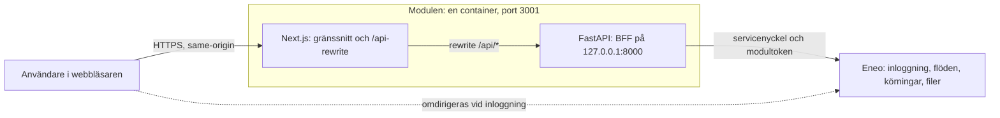
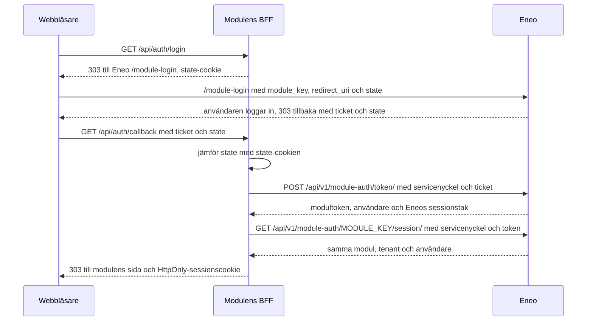
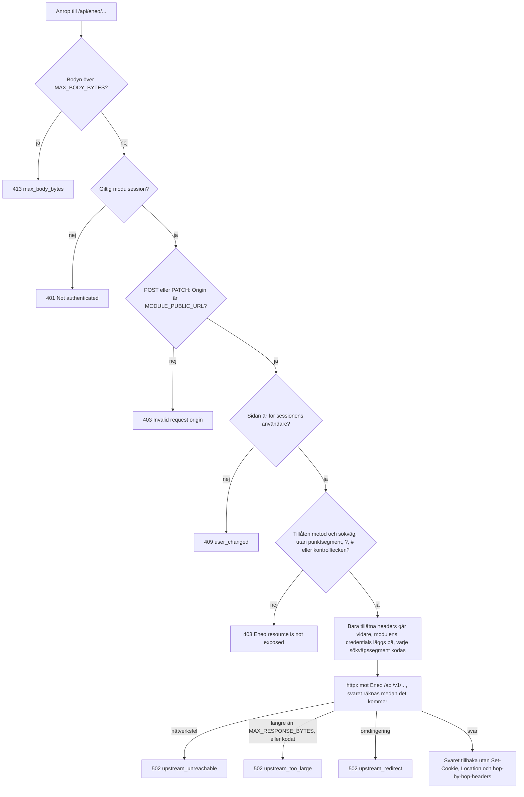
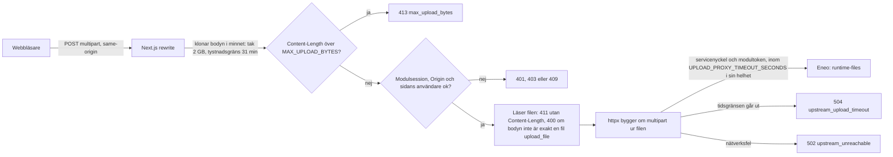
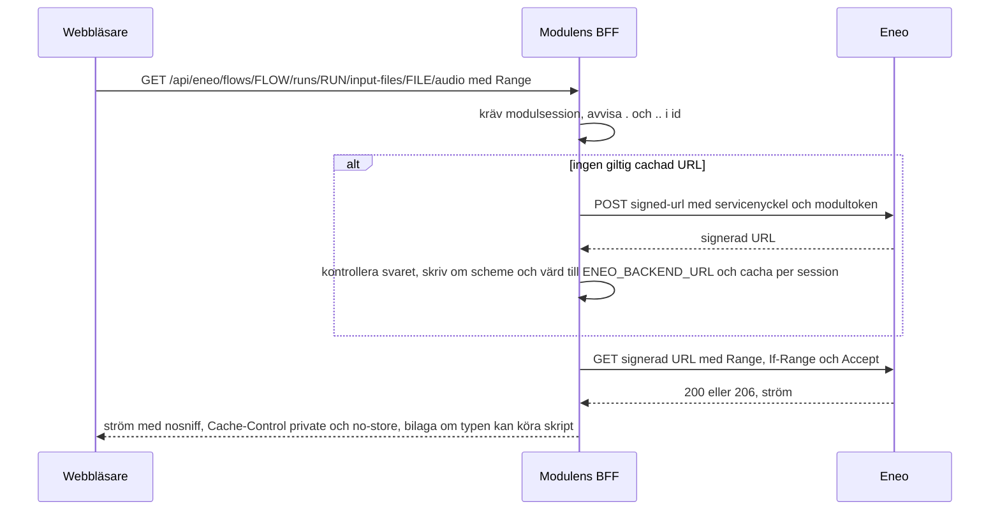
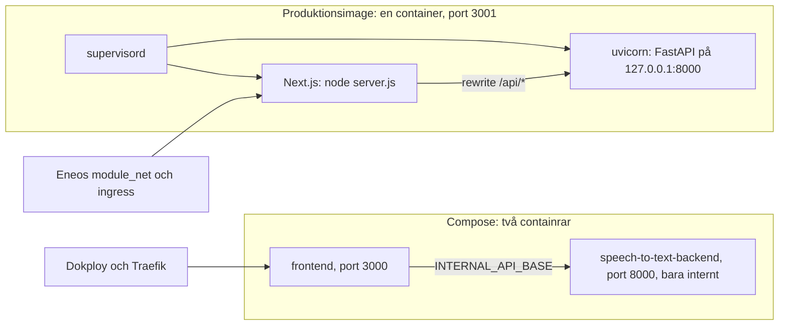
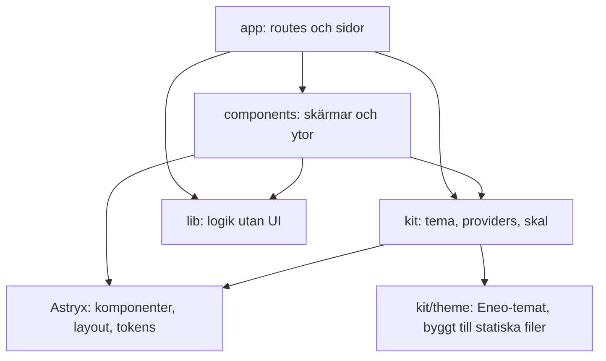
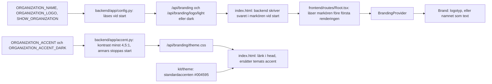

# Arkitektur

Syfte: Visa hur modulen är byggd, vilka delar som pratar med vilka och var gränserna för inloggning, filer och utseende går.

Läs detta när: Du är ny i koden, ska ändra något som korsar webbläsare, frontend, backend och Eneo, eller ska förklara systemet för någon annan.

Hör ihop med: [Inloggning och session](auth-and-session.md), [Backend](backend.md), [Frontend](frontend.md), [Drift](operations.md), [Beslut](decisions/README.md), [Ordlista](glossary.md)

## Översiktsbild

Bilden är illustrativ och ger överblicken. Mermaid-diagrammen längre ned är den beskrivning som gäller; om bilden och ett diagram skiljer sig åt är diagrammet rätt.

## Delarna

| Del | Vad den gör | Var den finns |
|---|---|---|
| Webbläsaren | Spelar in ljud, visar gränssnittet, talar bara same-origin med modulen. Har aldrig Eneos credentials. | körs från `frontend/` |
| Next.js | Serverar gränssnittet och skickar vidare allt under `/api/*` (och `/health`) till BFF:en med en rewrite. Sätter säkerhetsheaders. | `frontend/` (`next.config.mjs`) |
| BFF (FastAPI) | Håller modulsessionen, loggar in mot Eneo, lägger servicenyckel och modultoken på varje anrop, släpper bara igenom tillåtna Eneo-rutter, strömmar filer, relayar live-text. | `backend/app/` |
| Eneo | Autentiserar användaren och äger flöden, körningar och filer. | utanför det här repot |

## Läget i dag

| Status | Vad |
|---|---|
| Nuvarande | Next.js 16 är frontend-servern och FastAPI ligger internt bakom den. De körs i en image under supervisord (port 3001), eller som två containrar i Compose. Gränssnittet är på väg över till Astryx (se Migration nedan). |
| Planerat | Plan B: gränssnittet byggs som statiska filer och serveras av FastAPI, så att Next.js-servern, rewrite-hoppet och supervisord försvinner (en process). Plan C: ett delat modulkit i ett eget repo, `eneo-ai/eneo-module-kit`, som den här modulen senare flyttar över på. Plan B är inte påbörjat och väntar på ägarens besked; inget av detta är byggt här. |

Uppgifter och diagram nedan beskriver nuläget om inget annat sägs: Next.js är frontend-servern, och först Plan B skulle ta bort den.

## Systemkontext

Följ pilarna: webbläsaren pratar bara med modulen, modulens backend pratar med Eneo, och webbläsaren skickas till Eneo bara för att logga in.

## Inloggningen

Titta på vem som håller i vad: ticketen går via webbläsaren men växlas mot en token bara av BFF:en, och sessionscookien är ett slumpmässigt ID.

Stegen i ord, felkoder, förnyelse och åtkomstkodsläget står i [Inloggning och session](auth-and-session.md).

## Ett proxat anrop

Följ kontrollerna uppifrån och ned: ett anrop till Eneo når bara fram om det klarar taket, session, origin, sidans användare och tillåtelselistan, och bara några få av webbläsarens headers och modulens egna credentials går vidare.

Allowlisten, headrarna, gränserna och testerna beskrivs i [Backend](backend.md).

## Uppladdning och signerade filer

Först uppladdningen: filen går genom Next-hoppet och byggs om av BFF:en, som läser den först efter att den kontrollerat vem som skickar.

Sedan filer ut ur Eneo: webbläsaren får aldrig Eneos signerade URL, BFF:en hämtar den och strömmar bytes med Range intakt, och bara typer som inte kan köra skript öppnas inline.

## Driftsättning

Två sätt att köra samma kod: en image med båda processerna, och två containrar i Compose. Bara tjänsten som tar emot trafik exponeras.

Portar, miljövariabler, healthchecks och Dokploy-stegen står i [Drift](operations.md).

## Frontendens lager

Pilarna är tillåtna importriktningar. `kit/` importerar inget från `app/`, `components/` eller `lib/`, och `lib/` importerar ingen UI-kod.

Konventionerna per lager står i [Frontend](frontend.md) och [Designsystem](design-system.md).

## Var organisationens märke och accent kommer in

Märket och accentfärgen är driftsinställningar, inte byggparametrar. Namn och logga läses av backend vid start och skrivs in i sidans markör (`<meta name="eneo-branding">`), som sidan läser före första renderingen; accentfärgen kontrolleras vid start och når sidan som en stilmall som ersätter temats blå. Allt annat i utseendet följer modulens tema.

Hur en annan organisation ställer in det: [Byt organisation](branding.md). Beslutet och skälen: [0006](decisions/0006-white-label-branding.md).

## Gränser som inte flyttas

| Gräns | Innebörd | Detaljer |
|---|---|---|
| Credentials | Servicenyckel, modultoken, ticket och signerade fil-URL:er når aldrig webbläsarens JavaScript. | [Inloggning och session](auth-and-session.md#vad-som-aldrig-når-webbläsaren) |
| Same-origin | Webbläsaren anropar bara modulens egen origin; CSP:n tillåter inga andra. | `frontend/next.config.mjs` |
| Deny by default | BFF:en släpper bara igenom Eneo-rutter som är uppräknade. | [Backend](backend.md#tillåtelselistan-för-eneo-anrop) |
| En replik | Sessionslagret är processlokalt: kör en backendprocess. | [Drift](operations.md#sessionslagret-är-processlokalt) |
| Inspelningen ligger kvar | Ljudet sparas på enheten medan man spelar in och tas bort först när Eneo har tagit emot körningen. | [Inspelaren](recording.md) |

## Migration (temporary, removed by bead .24)

Gränssnittet har porterats från shadcn/Radix/Tailwind till Astryx; de två systemen samexisterar inte längre:

- Läget och planen: `docs/plans/2026-10-01-astryx-port-plan.md`; beslutsunderlaget: `docs/plans/2026-10-01-module-platform-design.md`.
- Det gamla systemet (`frontend/components/ui/`, Tailwind och dess konfiguration, `frontend/lib/utils.ts`, Radix) är borttaget. `frontend/lib/legacy-ui.test.ts` misslyckas om en import av det eller en klasssträng kommer tillbaka.
- Plan A (portningen) går före Plan B och C ovan; de två senare beslutas separat.
