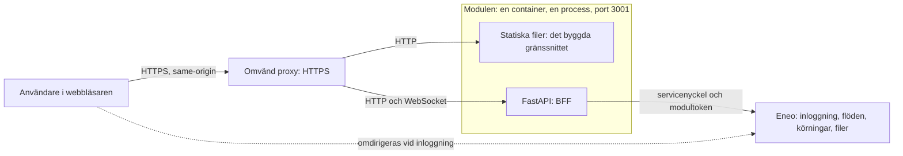

# Arkitektur

Modulen är en process, `python -m app.serve`, i en container. Den serverar det byggda gränssnittet (statiska filer) och API:t (en FastAPI-backend, BFF:en) på port 3001. Webbläsaren pratar bara med modulen; modulen pratar med Eneo. Modulen har ingen egen databas, inga egna konton och ingen replik: Eneo äger användare, flöden, körningar och filer, och sessionerna ligger i processens minne.

| Del | Vad den gör | Var den finns |
|---|---|---|
| Webbläsaren | Spelar in ljud, visar gränssnittet, talar bara same-origin med modulen. Har aldrig Eneos credentials. | `frontend/` byggs till `dist/` |
| BFF (FastAPI) | Serverar gränssnittet, håller sessionen, loggar in mot Eneo, lägger servicenyckel och modultoken på varje anrop, släpper bara igenom tillåtna Eneo-rutter, strömmar filer, relayar live-text. | `backend/app/` |
| Eneo | Autentiserar användaren och äger flöden, körningar och filer. | utanför det här repot |

## Begrepp

| Term | Betydelse |
|---|---|
| modul | Den här webbapplikationen, Tal till text (`MODULE_KEY=speech-to-text`), som Eneo länkar till. |
| BFF | Modulens backend i FastAPI (`backend/app/`): håller inloggningen, lägger credentials på och släpper bara igenom tillåtna anrop till Eneo. |
| flöde, körning | Ett publicerat arbetsflöde i Eneo, och en enskild exekvering av det med en användares indata. |
| granskning | En paus i en körning där en människa kontrollerar ett stegs resultat (`awaiting_review`). Talarmappning är en granskning. |
| Strömma, Spela in, Ladda upp | Flödessidans tre inmatningslägen: live-text medan man spelar in, inspelning med transkribering efteråt, och en vald fil. |

Sessionen, servicenyckeln och modultoken förklaras i [Inloggning och session](auth-and-session.md#vad-som-aldrig-når-webbläsaren).

## Systemkontext

Webbläsaren pratar bara med modulen, modulen pratar med Eneo, och webbläsaren skickas till Eneo bara för att logga in.

Inloggningen steg för steg: [Inloggning och session](auth-and-session.md). Vilka anrop till Eneo som släpps igenom, och hur en uppladdning och en signerad fil hanteras: [Backend](backend.md). Frontendens lager: [Frontend](frontend.md#lager). Organisationens märke och accent är driftsinställningar: [Byt organisation](branding.md).

## Gränser som inte flyttas

| Gräns | Innebörd | Detaljer |
|---|---|---|
| Credentials | Servicenyckel, modultoken, ticket och signerade fil-URL:er når aldrig webbläsarens JavaScript. | [Inloggning och session](auth-and-session.md#vad-som-aldrig-når-webbläsaren) |
| Same-origin | Webbläsaren anropar bara modulens egen origin; CSP:n tillåter inga andra. | [Backend](backend.md#statiska-filer-och-säkerhetsheaders) |
| Deny by default | BFF:en släpper bara igenom Eneo-rutter och headers som är uppräknade. | [Backend](backend.md#tillåtelselistan-för-eneo-anrop) |
| En process | Sessionslagret är processlokalt: en arbetsprocess, en container. | [Drift](operations.md#uppgradera) |
| Inspelningen ligger kvar | Ljudet sparas på enheten medan man spelar in och tas bort först när Eneo har tagit emot körningen. | [Inspelaren](recording.md) |
