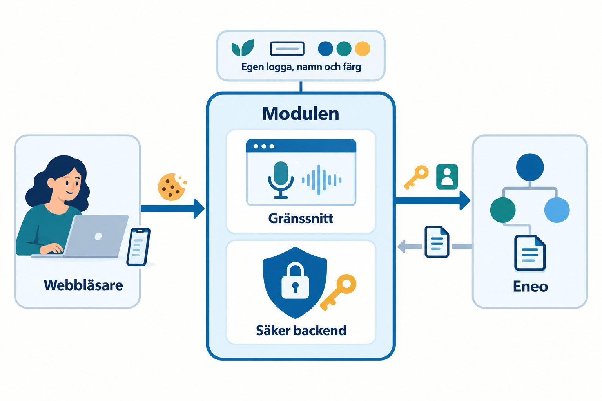
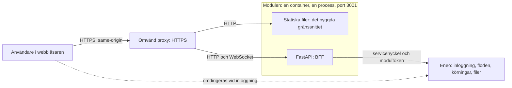
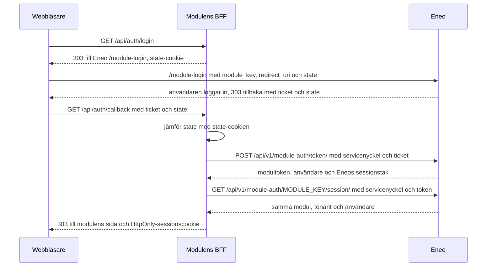
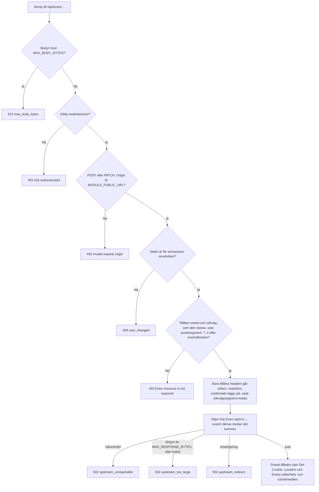
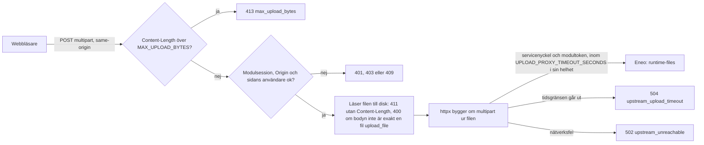
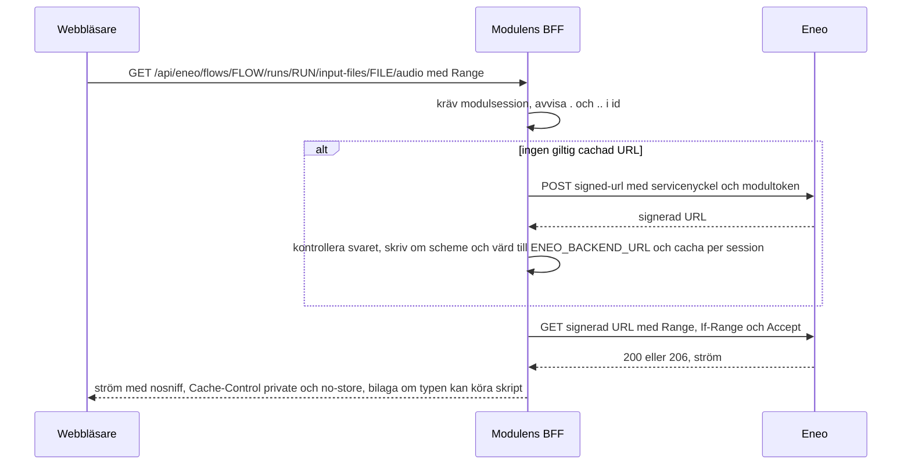
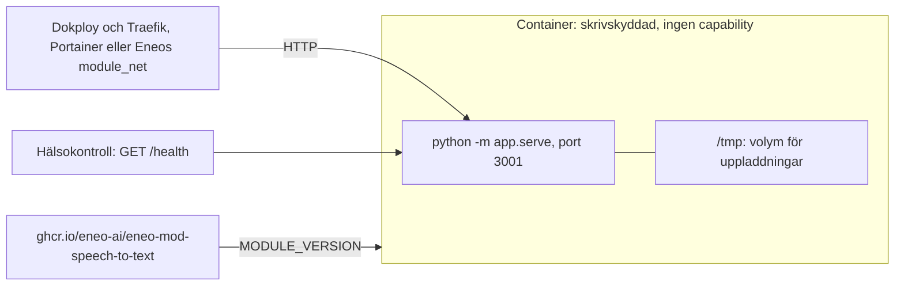
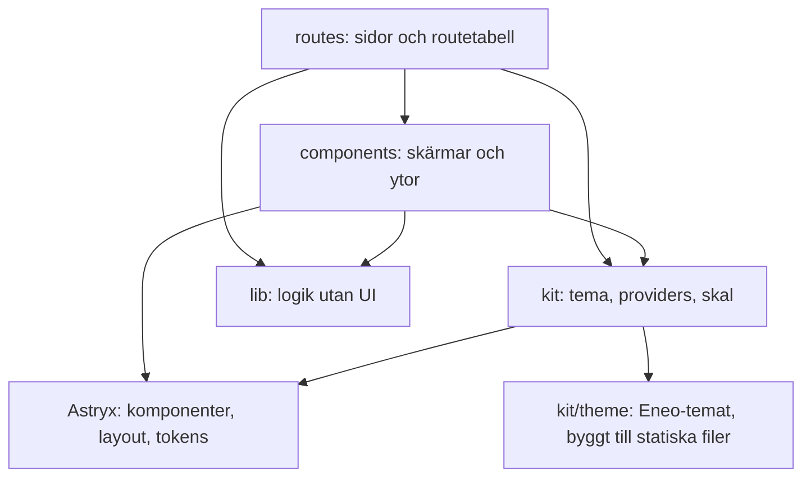
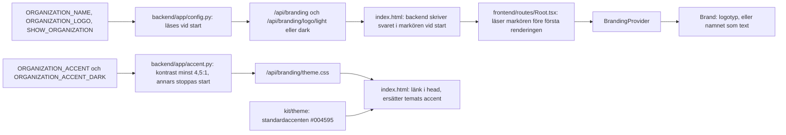

# Arkitektur

Bilden är en översikt; diagrammen nedan är beskrivningen som gäller.

Modulen är en process, `python -m app.serve`, i en container. Den serverar det byggda gränssnittet (statiska filer) och API:t (en FastAPI-backend, BFF:en) på port 3001. Webbläsaren pratar bara med modulen; modulen pratar med Eneo.

| Del | Vad den gör | Var den finns |
|---|---|---|
| Webbläsaren | Spelar in ljud, visar gränssnittet, talar bara same-origin med modulen. Har aldrig Eneos credentials. | `frontend/` byggs till `dist/` |
| BFF (FastAPI) | Serverar gränssnittet, håller modulsessionen, loggar in mot Eneo, lägger servicenyckel och modultoken på varje anrop, släpper bara igenom tillåtna Eneo-rutter, strömmar filer, relayar live-text. | `backend/app/` |
| Eneo | Autentiserar användaren och äger flöden, körningar och filer. | utanför det här repot |

## Begrepp

| Term | Betydelse |
|---|---|
| modul | Den här webbapplikationen, Tal till text (`MODULE_KEY=speech-to-text`), som Eneo länkar till. |
| BFF | Modulens backend i FastAPI (`backend/app/`): håller inloggningen, lägger credentials på och släpper bara igenom tillåtna anrop till Eneo. |
| modulsession | Modulens inloggning i webbläsaren: en HttpOnly-cookie med ett opakt ID. Allt som hör till sessionen ligger i BFF:ens minne. |
| servicenyckel | Modulens `sk_`-nyckel i Eneo (`ENEO_API_KEY`). Når aldrig webbläsaren. |
| modultoken | Kortlivad token Eneo ger BFF:en för den inloggade användaren. Skickas med servicenyckeln. |
| flöde, körning | Ett publicerat arbetsflöde i Eneo, och en enskild exekvering av det med en användares indata. |
| granskning | En paus i en körning där en människa kontrollerar ett stegs resultat (`awaiting_review`). Talarmappning är en granskning. |
| Strömma, Spela in, Ladda upp | Flödessidans tre inmatningslägen: live-text medan man spelar in, inspelning med transkribering efteråt, och en vald fil. |

## Systemkontext

Webbläsaren pratar bara med modulen, modulen pratar med Eneo, och webbläsaren skickas till Eneo bara för att logga in.

## Inloggningen

Ticketen går via webbläsaren men växlas mot en token bara av BFF:en, och sessionscookien är ett slumpmässigt ID.

Stegen i ord, felkoder och förnyelse: [Inloggning och session](auth-and-session.md).

## Ett proxat anrop

Ett anrop till Eneo når bara fram om det klarar taket, session, origin, sidans användare och tillåtelselistan, och bara några få av webbläsarens headers och modulens egna credentials går vidare.

Allowlisten, headrarna och gränserna: [Backend](backend.md).

## Uppladdning och signerade filer

Uppladdningen läses först efter att BFF:en kontrollerat vem som skickar, och byggs om av BFF:en innan den når Eneo.

Filer ut ur Eneo: webbläsaren får aldrig Eneos signerade URL. BFF:en hämtar den och strömmar bytes med Range intakt, och bara typer som inte kan köra skript öppnas inline.

## Driftsättning

En publicerad image körs som en container. Bara port 3001 tas emot trafik på, och en omvänd proxy framför står för HTTPS.

Variabler, proxyns gränser, utgåvor och Dokploy- och Portainer-stegen: [Drift](operations.md).

## Frontendens lager

Pilarna är tillåtna importriktningar: `kit/` importerar bara Astryx, och `lib/` ingen UI-kod.

Konventionerna per lager: [Frontend](frontend.md).

## Var organisationens märke och accent kommer in

Märket och accentfärgen är driftsinställningar, inte byggparametrar. Namn och logga läses av backend vid start och skrivs in i sidans markör (`<meta name="eneo-branding">`), som sidan läser före första renderingen; accentfärgen kontrolleras vid start och når sidan som en stilmall som ersätter temats blå.

Hur en annan organisation ställer in det: [Byt organisation](branding.md). Skälen: [beslut 0006](decisions/0006-white-label-branding.md).

## Gränser som inte flyttas

| Gräns | Innebörd | Detaljer |
|---|---|---|
| Credentials | Servicenyckel, modultoken, ticket och signerade fil-URL:er når aldrig webbläsarens JavaScript. | [Inloggning och session](auth-and-session.md#vad-som-aldrig-når-webbläsaren) |
| Same-origin | Webbläsaren anropar bara modulens egen origin; CSP:n tillåter inga andra. | [Backend](backend.md#statiska-filer-och-säkerhetsheaders) |
| Deny by default | BFF:en släpper bara igenom Eneo-rutter och headers som är uppräknade. | [Backend](backend.md#tillåtelselistan-för-eneo-anrop) |
| En process | Sessionslagret är processlokalt: en arbetsprocess, en container. | [Drift](operations.md#driftsätt-med-dokploy-eller-portainer) |
| Inspelningen ligger kvar | Ljudet sparas på enheten medan man spelar in och tas bort först när Eneo har tagit emot körningen. | [Inspelaren](recording.md) |
