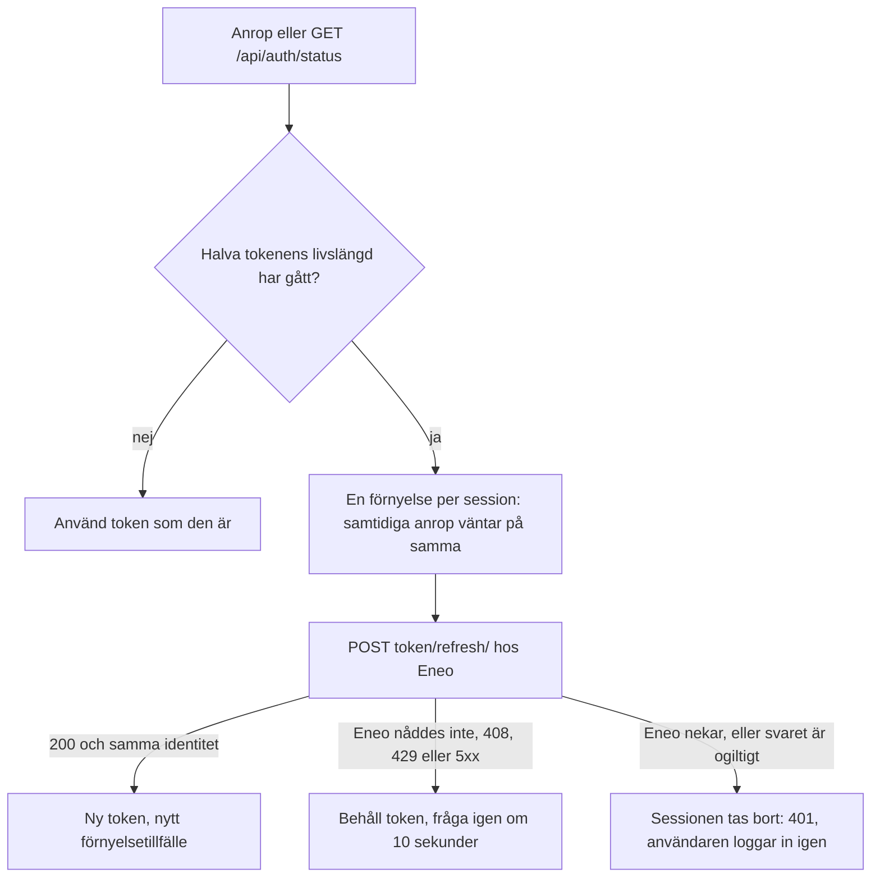

# Inloggning och session

Syfte: Beskriva hur en användare loggar in, vad som lagras var, hur sessionen förnyas och vad som aldrig lämnar backend.

Läs detta när: Du felsöker inloggning, ändrar något i `backend/app/module_auth.py` eller sessionshanteringen i frontend, eller ska svara på en säkerhetsfråga om credentials.

Hör ihop med: [Arkitektur](architecture.md#inloggningen), [Backend](backend.md), [Drift](operations.md), [Ordlista](glossary.md)

## Två lägen, aldrig blandade

`AUTH_MODE` väljer exakt ett inloggningsflöde. Okända värden, eller en konfiguration som blandar SSO med `APP_ACCESS_CODE`, stoppar backend vid start (`backend/app/config.py`).

| Läge | Användning | Identitet | Upstream-credentials |
|---|---|---|---|
| `eneo_sso` | Standard och permanent. | Eneos användare och tenant. | Servicenyckel och modultoken. |
| `access_code` | Tillfällig testgrind tills Eneos modulhandoff är deployad. | Ingen: en delad kod. | Bara servicenyckeln. |

En session som skapats i ett läge godtas aldrig i det andra (`backend/app/module_auth.py`, `_live_session`).

## Eneo SSO (`AUTH_MODE=eneo_sso`)

Modulen är ingen egen OIDC-klient. Eneo förblir installationens autentiseringsauktoritet och `ENEO_PUBLIC_URL` måste vara satt. Sekvensdiagram: [Inloggningen](architecture.md#inloggningen).

1. `GET /api/auth/login` skapar ett oförutsägbart, kortlivat `state`, binder det till en HttpOnly-cookie och skickar webbläsaren till Eneos `/module-login` med `module_key`, `redirect_uri` och `state`.
2. Eneo autentiserar användaren och skickar tillbaka en engångsticket till `/api/auth/callback`.
3. Callbacken verifierar och förbrukar `state` (cookien raderas), växlar ticketen server-side med modulens servicenyckel mot en modultoken, validerar identiteten med ett andra anrop (`/api/v1/module-auth/{module_key}/session/`, servicenyckel och token) och skapar en HttpOnly-modulsession.
4. Varje proxat Eneo-anrop skickar både servicenyckeln och den kortlivade modultoken som BFF:en hämtar ur sessionen.
5. När halva tokenens livslängd har gått förnyar BFF:en den via `POST /api/v1/module-auth/{module_key}/token/refresh/`. Nekar Eneo förnyelsen, till exempel när Eneos sessionstak har passerats, avslutas modulsessionen och användaren loggar in igen. Se [Förnyelse](#förnyelse-av-modultoken).

Callbacken redirectar alltid till en ren URL och svarar med `Referrer-Policy: no-referrer` och `Cache-Control: no-store`. Uvicorns accesslogg är avstängd i alla startsätt så att callbackens ticket och state inte hamnar i containerloggar. Ingress- eller Traefik-loggning måste också utesluta callbackens query string.

Modulen förutsätter Eneos stabila `module_key`-kontrakt, frontend-routen `/module-login` och Flow-resurser som kräver både servicenyckel och modultoken.

### Om callbacken misslyckas

Webbläsaren skickas till `/?auth_error=<kod>`. Sidan visar alltid samma svenska meddelande och tar bort parametern ur adressen; koden är till för felsökning.

| Kod | Betyder |
|---|---|
| `invalid_state` | Ticket eller state saknas, eller state matchar inte state-cookien (eller cookien har gått ut efter 5 minuter). |
| `exchange_unavailable` | BFF:en nådde inte Eneo vid ticketväxlingen. |
| `exchange_failed` | Eneo svarade med annat än 200 på ticketväxlingen. |
| `exchange_invalid` | Svaret hade fel format, fel modul eller en utgången session. |
| `validation_unavailable`, `validation_failed`, `validation_invalid` | Samma tre fall för valideringsanropet, inklusive att identiteten inte stämde med tokenens. |

## Sessionen

### Vad cookien innehåller

| Cookie | Innehåll | Egenskaper |
|---|---|---|
| `eneo_module_session` | Ett slumpmässigt, opakt ID (`secrets.token_urlsafe(32)`). Inget annat. | HttpOnly, SameSite=Lax, `Secure` när `COOKIE_SECURE=true`, path `/`, livslängd till sessionens slut. |
| `eneo_module_login_state` | Signerat (itsdangerous med `SESSION_SECRET`) login-state: `state`, vart användaren ska tillbaka, och vid förnyelse vilken användare och tenant det gäller. | HttpOnly, SameSite=Lax, path `/api/auth/callback`, 5 minuter. |

### Sessionslagret

- Lagret är en process-lokal ordbok i backendminnet (`ModuleSessionStore` i `backend/app/module_auth.py`) med ett lås. Utgångna sessioner städas bort vid varje skapande och uppslag.
- Sessionen innehåller användaren, tenant, modultoken, när token går ut, när den ska förnyas och inloggningens fasta slut.
- Logout (`POST /api/auth/logout`, same-origin) tar bort sessionen direkt och raderar cookien.
- En ny inloggning (callbacken eller åtkomstkodsinloggningen) tar bort den session webbläsaren hade, och med den allt som hänger på den. En öppen live-socket stängs när sessionen tar slut på något sätt (utloggning, utgång, ersättning, nekad förnyelse), se [Backend](backend.md#live-reläet).
- En omstart av backend ger ny login för alla. Mer än en backendreplik kräver att lagret flyttas till en delad store, se [Drift](operations.md#sessionslagret-är-processlokalt).

### Hur länge en inloggning gäller

Inloggningens fasta slut är det tidigaste av `SESSION_MAX_AGE_MINUTES` (standard 480, alltså 8 timmar) och Eneos eget sessionstak (`MODULE_AUTH_MAX_SESSION_HOURS` hos Eneo). Bara en ny inloggning kan flytta slutet. `GET /api/auth/status` talar om hur många sekunder som återstår (`session_ends_in`).

### Förnyelse av modultoken

Modultoken är kortlivad och förnyas automatiskt mot Eneo så länge inloggningen gäller.

- Förnyelsen sker i `require_session` och i `status`, så även en session som bara spelar in (inga andra anrop) förnyas: statussvaret innehåller `refresh_in`, och sidan frågar igen då (`frontend/lib/session-keepalive.ts`).
- Förnyelsen avbryts inte av att ett enskilt anrop försvinner, och ett utdraget förnyelseanrop håller inte upp andra sessioner.
- Ett svar där användare, tenant eller modul ändrats avslutar sessionen.
- Är token redan så lång att den når inloggningens slut finns ingen förnyelse (`refresh_in` utelämnas).

### Förnya inloggningen i förväg

Fem minuter före slutet varnar sidan (`frontend/components/SessionEndWarning.tsx`) och erbjuder en ny inloggning utan att lämna sidan, så att inget går förlorat (WCAG 2.2.1):

- I `eneo_sso` öppnas ett eget fönster med `GET /api/auth/login?renew=1&next=/inloggad`. Förnyelsen binds till användaren som är inloggad nu: loggar någon annan in avslutas inte sessionen, utan sidan skickas till `/inloggad?fel=annan-anvandare`.
- Har inloggningen redan gått ut finns ingen att binda till. `renew=1` utan live-session avvisas till `/inloggad?fel=utgangen`; en vanlig ny inloggning låser upp sidan bara för sidans egen användare.
- Med åtkomstkod skriver användaren koden i dialogen.
- Sidans övriga flikar får veta att inloggningen förnyats över `BroadcastChannel` med namnet `tal-till-text:session`.
- `next` accepteras bara som en sökväg på modulens egen origin (börjar med `/`, inte `//`, inget bakstreck); annars `/flows`.

### När inloggningen har gått ut

Sidan navigerar inte bort. Den ligger kvar, dold och låst (`SignedOutCover` i `frontend/components/AuthGate.tsx`), en pågående inspelning fortsätter att spara på enheten, och en dialog ber om ny inloggning. Medan inloggningen saknas skickas inget från sidan (`frontend/lib/login-state.ts`, `frontend/lib/api.ts`): en förfrågan som tål att skickas två gånger (GET, eller en med `Idempotency-Key`) väntar på den nya inloggningen och går sedan; övriga misslyckas och användaren trycker igen. Se [beslutet om täckskiktet](decisions/0004-native-dialogs-and-the-session-cover.md).

### Sidans användare i en gammal flik

Webbläsaren har en cookie för alla flikar. Loggar någon in i en flik ersätts sessionen, och en gammal flik skulle fortsätta skicka ljud, eller ändra något annat, under den nya personens session. Därför namnger en sida den användare (och tenant) den öppnades för, och BFF:en jämför id:n (`is_another_user` och `require_expected_user` i `backend/app/module_auth.py`):

| Väg | Hur sidan namnger användaren | Saknas namnet, eller är det en annan |
|---|---|---|
| Uppladdningarna och `/api/eneo/{path}` | Headrarna `X-Expected-User` och `X-Expected-Tenant` | `409` med `{"detail": "user_changed"}`, innan bodyn läses. Ingenting når Eneo. |
| Live-socketen | Frågeparametrarna `?expected_user=` och `expected_tenant` (en webbläsare kan inte sätta en header på en WebSocket) | Stängs med `1008` och skälet `user_changed`, innan någon biljett begärs hos Eneo. |

- **Krävs för `eneo_sso`:** namnet måste finnas på varje request under `/api/eneo/` som ändrar något (inte GET, HEAD eller OPTIONS: uppladdningar, start av körning, PATCH, avbryt) och på live-socketen. Ett namn som saknas ger samma `user_changed` som ett fel namn.
- **En GET får sakna namn,** eftersom ett `<audio src>` och en navigering inte kan skicka en header, men ett namn den ger måste vara sessionens. GET av ljud och genererade filer kontrollerar inte sidans användare alls: en PDF-ram kan inte heller sätta headers, och Eneo auktoriserar själv körningen.
- **En åtkomstkodssession** har ingen användare att jämföra med och godtas alltid.
- Namnet är ett id, ingen hemlighet, och skickas aldrig vidare till Eneo.
- **Användaren räcker, tenant behövs inte:** i Eneo hör en användare till exakt en tenant, och det går inte att ändra. `users.tenant_id` är obligatorisk, det finns ingen medlemskapstabell och ingen väg som flyttar en användare. Användar-id:n skapas av servern som UUID:er. Modulens token bär användarens enda tenant och kontrolleras mot den vid varje anrop (Eneos `modules/module_auth.py`, verifierat 2026-10-02). Samma användar-id betyder därför samma tenant. Ändrar Eneo den regeln måste sidan börja skicka `X-Expected-Tenant` också.

Frontend namnger användaren på varje anrop under `/api/eneo/` (uppladdningen inräknad) och på varje ny live-anslutning, ur den identitet sidan öppnades med; den skickar ingen tenant (`expectedUser` i `frontend/lib/login-state.ts`, `frontend/lib/api.ts`, `frontend/lib/live-transcriber.ts`).

- **409 eller 1008 `user_changed`:** sidan skickar aldrig om en förfrågan som fått 409 `user_changed`, vem som än loggar in härnäst. Den visar täckskiktet som när en inloggning gått ut ([ovan](#när-inloggningen-har-gått-ut)) och läser om sessionsstatus, så att täckskiktet säger vem man ska logga in som. En uppladdning misslyckas som en utgången session, och inspelningen ligger kvar på enheten.
- **1008 `session_ended`** (sessionen tog slut under en öppen live-socket) täcker också sidan. Live-texten öppnar ingenting förrän sidans egen användare är tillbaka, och fortsätter då som efter ett avbrott.

Tester: `ExpectedUserTests` och `LiveExpectedUserTests` i `backend/tests/test_boundary.py`.

## Åtkomstkod (`AUTH_MODE=access_code`, tillfällig)

Läget finns endast för fristående test innan hela SSO-handoffen är deployad. Det är ingen permanent reserv.

- `APP_ACCESS_CODE` sätts som Dokploy-secret med 16–256 tecken. Generera den med `python -c "import secrets; print(secrets.token_urlsafe(24))"` och rotera vid behov.
- Koden jämförs i konstant tid i backend, skickas aldrig i URL:en (`POST /api/auth/login`, same-origin) och persisteras inte. Vid lyckad login skapas samma sorts slumpmässiga, opaka HttpOnly-session som i SSO-läget. Fel kod ger ett generiskt 401.
- Korta koder som `komin` nekas redan vid start.

Begränsningar:

- åtkomstkoden är en delad grind, inte en användaridentitet; den ger ingen per-person- eller tenant-audit;
- `ENEO_API_KEY` är fortfarande obligatorisk och används för anrop till Eneo;
- upstream-anrop skickar endast servicenyckeln, aldrig en påhittad Bearer-token;
- när Eneo kräver både servicenyckel och modultoken nekas därför Flow-anrop;
- sessionen löper ut efter `SESSION_MAX_AGE_MINUTES` och försvinner vid omstart;
- skydda publika testmiljöer med ingress-rate-limit; testgrinden ersätter inte riktig användarautentisering.

Avvecklingspunkt: när [eneo#536](https://github.com/eneo-ai/eneo/pull/536) är deployad och ett live-smoke-test har verifierat `/module-login`, callback och ticketväxling, `/api/v1/module-auth/speech-to-text/session/` samt ett Flow-anrop med dubbla credentials, byt till `AUTH_MODE=eneo_sso`, radera `APP_ACCESS_CODE` i Dokploy och ta bort access-code-koden, gränssnittet, dokumentationen och testerna i nästa cleanup-PR.

## Vad som aldrig når webbläsaren

| Hemlighet | Var den finns | Hur den hålls borta |
|---|---|---|
| Servicenyckeln (`ENEO_API_KEY`) | Backendens miljö | Läggs på i BFF:en. Bara ett fåtal request-headers går vidare från webbläsaren ([Backend](backend.md#headers)), så ingen `Authorization`, `Cookie`, `X-API-Key` eller konfigurerad nyckelheader kommer med. Uppladdningar och filströmmar tar inga av webbläsarens headers med, utom `Range`, `If-Range` och `Accept` för filer. |
| Modultoken | Backendens minne, i sessionen | Webbläsaren har bara sessions-ID. |
| Login-ticketen | Passerar en gång i callbackens URL | Callbacken redirectar till en ren URL, ingen referrer, ingen accesslogg. |
| Signerade fil-URL:er | Backendens cache, per session | BFF:en hämtar och strömmar filen; CSP:n tillåter bara same-origin media och ramar. |
| Live-transkriptionens ticket | Backend | Öppnar Eneos WebSocket server-side; webbläsaren ser aldrig ticketen. |
| Eneos cookies och `Location` | Eneos svar | Klienten mot Eneo lagrar och skickar inga cookies, `Set-Cookie` och `Location` skickas inte vidare, och en omdirigering från Eneo är ett 502. |
| Åtkomstkoden | Backendens miljö | Skickas av användaren en gång i en POST-body, jämförs i konstant tid, sparas inte. |

Testerna som håller detta: `backend/tests/test_module_auth.py`, `backend/tests/test_eneo_proxy_auth.py`, `backend/tests/test_audio_proxy.py` och `CookieJarTests` och `RedirectFromEneoTests` i `backend/tests/test_boundary.py`.

## Kontrollen av origin

`require_same_origin` (`backend/app/module_auth.py`) kräver att `Origin` är modulens egen (`MODULE_PUBLIC_URL`) för allt utom GET, HEAD och OPTIONS. En WebSocket-handskakning är en GET men kontrolleras som en mutation, och avvisas med stängningskod 1008 innan anslutningen accepteras.

## Tidsgränser (WCAG 2.2.1)

Inloggningen varnar fem minuter före slutet och kan förnyas utan att lämna sidan. En granskningspaus visar när Eneo avbryter körningen. Kriteriet uppfylls bara när flödets granskningsfönster är längre än 20 timmar; Eneos standard är 14 dagar, och ett flöde som ställer in ett kortare fönster uppfyller det inte.
