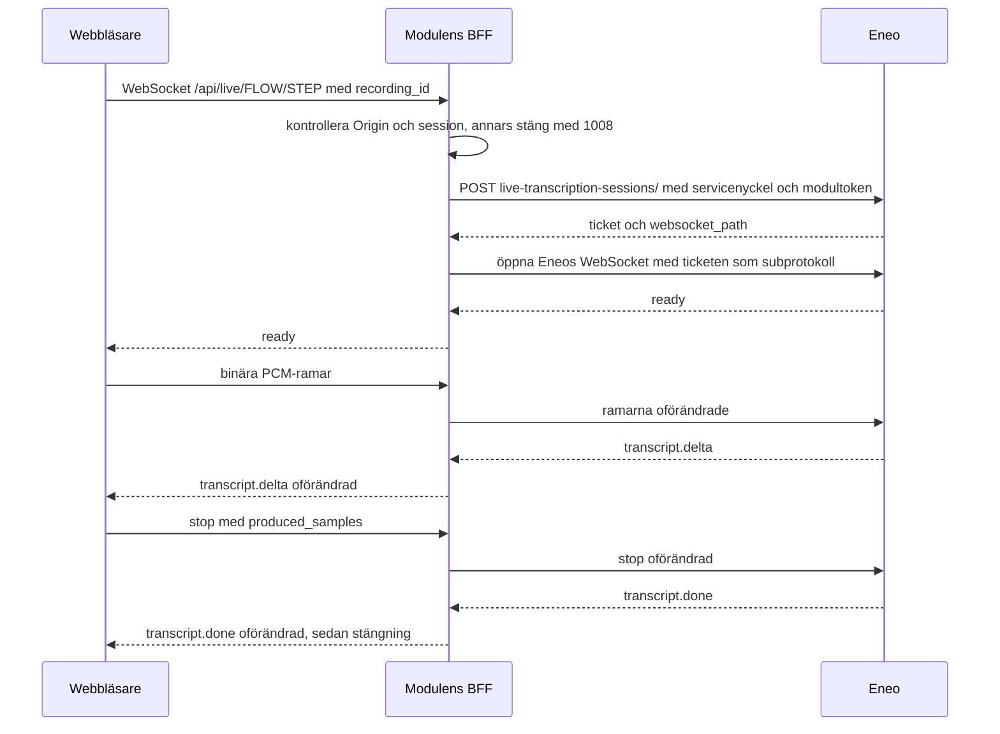

# Eneo-integration

## Så byggs en körning

Appen bygger körningen från Eneos publicerade flödeskontrakt:

1. `GET /api/v1/flows/{flowId}/run-contract/` hämtas innan användaren kör flödet.
2. Ljudsteget väljs från `steps_requiring_input`.
3. Filstorlek och MIME-typ valideras mot stegets `max_file_size_bytes` och `accepted_mimetypes`.
4. Ljud laddas upp till steg-scopade runtime-endpointen: `POST /api/v1/flows/{flowId}/steps/{stepId}/runtime-files/`.
5. Körningen startas först efter lyckad upload och skickar filen så här:

```json
{
  "expected_flow_version": 3,
  "step_inputs": {
    "step-id": {
      "file_ids": ["uploaded-file-id"]
    }
  }
}
```

Uppladdning och start går genom `frontend/lib/submit-run.ts`: nätverksfel, 408, 429 och 5xx provas igen med en väntetid som börjar på 1 s och fördubblas upp till 60 s, och direkt när anslutningen är tillbaka. Körningen startas med samma idempotensnyckel vid varje försök. Andra 4xx-fel stoppar med Eneos felmeddelande. Mer om det på användarens sida i [Inspelaren](recording.md#uppladdning-och-nya-försök).

Webbläsaren anropar alltid modulens `/api/eneo/...`; vilka rutter som finns står i [Backend](backend.md#tillåtelselistan-för-eneo-anrop).

## Granskning och talarmappning

Ett publicerat flöde kan innehålla steg med `review_policy` som pausar körningen i status `awaiting_review`. Appen pollar `GET /api/v1/flows/{flowId}/runs/{runId}/` och hämtar då den aktiva checkpointen via `GET …/runs/{runId}/review-checkpoints/active/` (`frontend/lib/follow-run.ts`).

### Talarmappning är en granskning

Talarmappning (Eneo-stegtypen `output_mode = "speaker_mapping"`) är inget eget API utan en sådan checkpoint med `review_mode = "edit"`. Appen känner igen den på att `current_payload_json` innehåller nyckeln `speaker_mapping` med talarinventariet (`SPEAKER_00`, `SPEAKER_01` … med antal repliker och exempelrepliker) och `structured.speakers` med modellens namnförslag. Före körningen avslöjas steget i run-kontraktets `steps_requiring_review` genom det pinnade `output_contract`; appen visar då en hint i inställningsvyn.

Vyn "Vem är vem?" låter användaren välja deltagare per talare (deltagarlistan från formulärfältet, "Annan person …" med fritext, eller "Ingen"). Vid "Spara och fortsätt" skickas mappningen som stegets output:

```json
PATCH /api/v1/flows/{flowId}/runs/{runId}/review-checkpoints/{checkpointId}/
{
  "expected_checkpoint_revision": 1,
  "edited_value": {
    "speakers": [
      { "label": "SPEAKER_00", "name": "Anna", "confidence": "high", "evidence": "…" },
      { "label": "SPEAKER_01", "name": null, "confidence": "low", "evidence": "" }
    ]
  }
}
```

Varje etikett i inventariet måste förekomma exakt en gång; talare utan namn behåller sin etikett. Eneo räknar om transkriptet med namnen och uppdaterar `{{transkribering}}` på körningen. Därefter anropas `…/approve/` och `…/resume/` (med `Idempotency-Key`) som för alla andra checkpoints, och appen fortsätter polla. `edited_value` är alltid stegets output i sig, en sträng för `text`-steg och ett JSON-värde för `json`-steg, aldrig payload-kuvertet.

### Spelaren och transkriptet

Vyn spelar samtidigt upp inspelningen med ett följande transkript:

- Segmenten (talare, start och slut per replik) hämtas från transkriberingsstegets `input_payload_json.transcription` via `GET …/runs/{runId}/steps/`.
- Ordtiderna kommer från `GET …/steps/{stepId}/transcript-words/`. 404 betyder inga ordtider, och då markeras bara repliken.
- Saknas segment parsas den renderade texten med sekundprecision.

Ljudet strömmas same-origin via modulens backend: `GET /api/eneo/flows/{flowId}/runs/{runId}/input-files/{fileId}/audio`. Backend hämtar Eneos signerade URL (`POST …/input-files/{fileId}/signed-url/`) med sina egna credentials, cachar den per session tills den går ut och vidarebefordrar `Range`-förfrågningar oförändrat. Webbläsaren ser aldrig Eneos token, och CSP:ns `media-src 'self'` behålls. Detaljer: [Backend](backend.md#filer-ut-ur-eneo).

### Rättningar

Repliker kan rättas direkt i spelaren (hovra, penna) och en replikgrupp kan byta talare (klicka på namnet). Rättningarna är icke-destruktiva och sparas per ändring till Eneos `…/steps/{stepId}/transcript-corrections/` med replace-semantik och `expected_revision`; Eneo viker in dem i transkriptet när granskningen godkänns. Rättning kräver att steget lagrade `transcription.segments`: fallback-parsad text går inte att förankra. Samma spelare, skrivskyddad, visas på resultatsidan för alla körningar med ett transkriberingssteg, med namnen från ett eventuellt speaker-mapping-steg.

Rättningarna skickas som ett komplett ersättningsset per transkriberingssteg (schema 3, `frontend/lib/transcript-corrections.ts`):

```json
PATCH /api/v1/flows/{flowId}/runs/{runId}/steps/{stepId}/transcript-corrections/
{
  "schema_version": 3,
  "segments_hash": "<originalets 64-teckens hash från Eneo>",
  "expected_revision": 8,
  "occurrences": [],
  "speaker_edits": [
    { "segment_index": 0, "char_start": null, "char_end": null, "original": null,
      "original_speaker": "SPEAKER_00", "speaker": "SPEAKER_00", "decision": "confirmed" }
  ]
}
```

- `expected_revision` är `null` för första setet och senast accepterade revision därefter. Ett beslut för ett helt källsegment har `null` som teckengränser och `original`; ett delbeslut har ett exakt, icke-tomt intervall och `original` med samma text. `decision: "unresolved"` har `speaker: null`; originalets talare kan själv vara `null`.
- **Originalet är oföränderligt:** modellens talare, överlappens id, ordningen och råtexten sparas oberoende av rättningar. Hashen kommer från transkriberingens metadata eller ett kompatibelt, icke-föråldrat svar, aldrig från normaliserad text.
- **Teckenpositioner är Unicode-kodpunkter** på tråden och UTF-16 i webbläsaren; modulen konverterar åt båda håll.
- En markering kan korsa källsegment: modulen skapar motsvarande beslut för varje och skickar ett ersättningsset. Ett beslut att bekräfta samma talare räknas, och "olöst" är något annat än ogranskat.
- En textändring gör berörda ordtider ogiltiga; orörda tider och originalets uppspelningsgränser bevaras. En rättning som inte kan samsas med talargränserna avvisas, och gränserna flyttas aldrig i tysthet.
- Metadata är filspecifik (`transcription.speaker_review.files`); Eneos filprefixerade överlapp-id och filindex bevaras.
- Konflikter förblir konflikter: en föråldrad hash, ett ogiltigt ankare eller en annan revision blir aldrig en lyckad överskrivning, och ett nytt försök behåller den ursprungliga revisionen.
- Sparandet går i en kö som skriver hela listan i taget. Ett misslyckande behåller de lokala utkasten, blockerar senare ersättningar och hindrar att godkännandet rapporterar lyckat; osparade utkast kan laddas ned. Godkännandet väntar på kön, och uttryckligen olösta passager är tillåtna.

Efter en rättning av en färdig körning kan dokumentet göras om ur det granskade transkriptet: `POST …/steps/{stepId}/transcript-regenerations/` skapar en ny körning med korrigeringsrevisionen som idempotensnyckel; källkörningen och dess filer ändras aldrig (`frontend/lib/regenerate.ts`). Webbläsarens egna bekräftelser av osäkra ord (`lib/confirmed-words.ts`) är lexikal granskning och sparas inte som talarbeslut.

## Live-text (Strömma)

Strömma visar texten medan användaren spelar in. Inspelningen laddas upp och flödet körs som i Spela in. Har en enda live-session hört hela inspelningen, och inspelningen är en enda fil, använder körningen sessionens text i stället för att transkribera ljudet en gång till. Annars transkriberar körningen ljudet som vanligt. Run-kontraktets `transcription.live` säger i förväg om flödets ljudsteg kan visa live-text.

Följ pilarna: biljetten hämtas och används bara av BFF:en, och ramarna och Eneos händelser går oförändrade åt vardera håll.



### Protokollet

Webbläsaren öppnar en WebSocket till `/api/live/{flowId}/{stepId}?recording_id={id}` på modulens egen origin, där `id` är inspelningens id på enheten (`frontend/lib/live-transcriber.ts`). Den skickar mono PCM16 LE i 16 kHz som binära ramar och till sist `{"type":"stop","produced_samples":n}`, där `n` är alla sampel inspelningen gav sessionen, räknade innan något köas eller kastas. Efter ett avbrott och en ny session skickas bara `{"type":"stop"}`, och en fortsatt inspelning namnger ingen inspelning.

Modulens backend (`live_transcription` i `backend/app/main.py`):

1. släpper bara in en inloggad användare vars `Origin` är `MODULE_PUBLIC_URL` (handskakningen är en GET men kontrolleras som en mutation) och stänger annars med 1008 innan anslutningen accepteras. Sidan måste namnge sin användare med `?expected_user=` (och `expected_tenant`); saknas namnet, eller är det en annan än sessionens, stängs socketen med 1008 `user_changed` innan någon ticket begärs ([Sidans användare](auth-and-session.md#sidans-användare-i-en-gammal-flik));
2. begär en engångsticket med `POST /api/v1/flows/{flowId}/steps/{stepId}/live-transcription-sessions/` och samma dubbla credentials som övriga Flow-anrop, efter att ha förnyat modultoken om det är dags. Ett giltigt `recording_id` (`^[A-Za-z0-9_-]{8,64}$`) följer med i anropets body; saknas det eller är det ogiltigt blir sessionen bara en förhandsvisning;
3. öppnar Eneos WebSocket server-side med ticketen som subprotokoll och utan webbläsarens `Origin`; ticketen når aldrig webbläsaren;
4. skickar ramar och `stop` oförändrade till Eneo, och Eneos JSON-händelser (`ready`, `transcript.delta`, `transcript.done`, `error`) oförändrade tillbaka. Stänger ena sidan stänger backend den andra, och tar sessionen slut stänger backend båda med 1008 `session_ended`.

Nekar Eneo ticketen, till exempel 409 `flow_live_transcription_unavailable`, får webbläsaren en enda `error`-händelse med Eneos `code` och sedan en normal stängning. Når backend inte Eneo blir koden `upstream_unreachable` med `retryable: true`.

### Att återanvända live-texten i körningen

Har `transcript.done` ett `transcript_id` sparas det med inspelningen på enheten, så länge inspelningen är en enda del och ingen sändning har börjat. En ny del glömmer det. Körningen skickar det som `step_inputs[stepId].live_transcript_id` bredvid stegets enda fil, och det ingår i den sparade körningsbegäran, så en upprepad sändning är identisk. Nekar Eneo det (`flow_run_live_transcript_not_found`, `flow_run_live_transcript_already_bound` eller `flow_run_live_transcript_requires_one_audio_file`) glöms det, och samma begäran utan det skickas en gång under samma nyckel. Användaren ser inget av detta.

### Gränser och drift

- Gränserna för meddelandestorlek, kö och skrivtid, och hur socketen följer sessionen, står i [Backend](backend.md#live-reläet).
- Traefik (v3.7) släpper igenom uppgraderingen och webbläsarens `Origin` utan extra konfiguration; imagens acceptans kör `/api/live` genom Traefik v3.7.13 ([Tester](quality-gates.md#imagens-acceptans)).
- Går `ENEO_BACKEND_URL` via en proxy måste den också släppa igenom WebSocket-uppgraderingar till Eneo.
