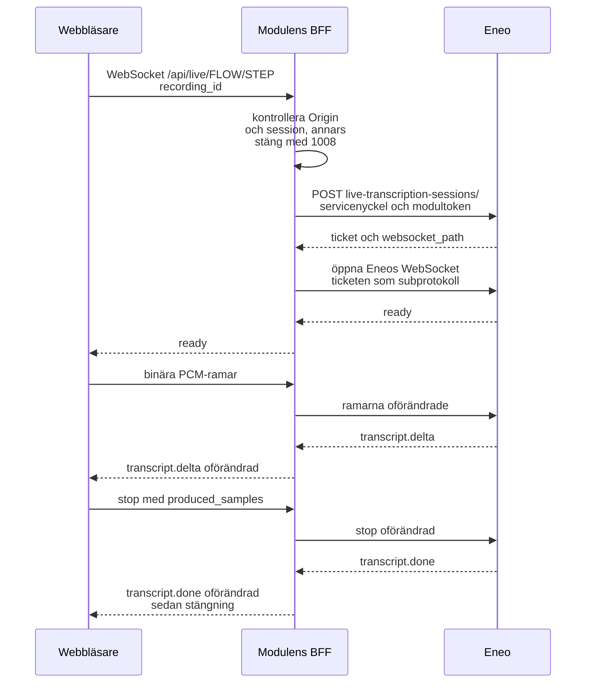

# Eneo-integration

## Så byggs en körning

Appen bygger körningen från Eneos publicerade flödeskontrakt:

1. `GET /api/v1/flows/{flowId}/run-contract/` hämtas innan användaren kör flödet.
2. Ljudsteget väljs från `steps_requiring_input`.
3. Filstorlek och MIME-typ valideras mot stegets `max_file_size_bytes` och `accepted_mimetypes`.
4. Ljud laddas upp till steg-scopade runtime-endpointen: `POST /api/v1/flows/{flowId}/steps/{stepId}/runtime-files/`.
5. Körningen startas först efter lyckad upload och skickar filen så här:

```json
{
  "expected_flow_version": 3,
  "step_inputs": {
    "step-id": {
      "file_ids": ["uploaded-file-id"]
    }
  }
}
```

Uppladdning och start går genom `frontend/lib/submit-run.ts`, som provar om vid tillfälliga fel och startar körningen med samma idempotensnyckel vid varje försök: [Inspelaren](recording.md#uppladdning-och-nya-försök).

Webbläsaren anropar alltid modulens `/api/eneo/...`; vilka rutter som släpps igenom står i [API-referens](api-referens.md) och reglerna i [Backend](backend.md#tillåtelselistan-för-eneo-anrop).

## Granskning och talarmappning

Ett publicerat flöde kan ha steg med `review_policy` som pausar körningen i status `awaiting_review`. Appen följer körningen (`GET …/runs/{runId}/`, `frontend/lib/follow-run.ts`) och hämtar då den aktiva checkpointen. Talarmappning är en sådan checkpoint (`review_mode = "edit"`, stegtypen `output_mode = "speaker_mapping"`): användaren väljer en deltagare per talare i "Namnge talarna", och "Spara namnen" skickar mappningen som stegets output (`edited_value` är alltid stegets output i sig, aldrig payload-kuvertet). Sidans "Godkänn och fortsätt" anropar sedan `approve` och `resume` (med `Idempotency-Key`) och appen fortsätter följa körningen. Granskningen är ett byggalternativ och av i en publicerad image ([Drift](operations.md#miljövariabler)).

Anropen mot Eneo (alla via [tillåtelselistan](backend.md#tillåtelselistan-för-eneo-anrop)):

- `GET …/runs/{runId}/review-checkpoints/active/`, `PATCH …/review-checkpoints/{checkpointId}/` med `expected_checkpoint_revision`, och `POST …/approve/`, `…/reject/`, `…/resume/`.

### Spelaren och transkriberingen

Vyn spelar upp inspelningen med en transkribering som följer ljudet. Segmenten (talare, start och slut per replik) kommer från `GET …/runs/{runId}/steps/`, ordtiderna från `GET …/steps/{stepId}/transcript-words/` (404 betyder inga ordtider, och då markeras bara repliken), och ljudet strömmas via modulens backend ([Backend](backend.md#filer-ut-ur-eneo)).

### Rättningar

Repliker kan rättas i spelaren och en replikgrupp kan byta talare. Rättningarna är icke-destruktiva: de sparas per ändring som ett komplett ersättningsset (`PATCH …/steps/{stepId}/transcript-corrections/`, schema 3, med `expected_revision` och transkriberingens hash), och Eneo viker in dem när granskningen godkänns. Originalet ändras aldrig, och en föråldrad hash, ett ogiltigt ankare eller en annan revision blir aldrig en lyckad överskrivning. Schemat och reglerna för teckenpositioner finns i `frontend/lib/transcript-corrections.ts` och dess tester. Efter en rättning av en färdig körning kan dokumentet göras om ur den granskade transkriberingen: `POST …/steps/{stepId}/transcript-regenerations/` skapar en ny körning, och källkörningen och dess filer ändras aldrig (`frontend/lib/regenerate.ts`).

## Live-text (Strömma)

Strömma visar texten medan användaren spelar in. Inspelningen laddas upp och flödet körs som i Spela in; har en enda live-session hört hela inspelningen, och den är en enda fil, använder körningen sessionens text i stället för att transkribera ljudet en gång till. Run-kontraktets `transcription.live` säger i förväg om flödets ljudsteg kan visa live-text. Ticketen hämtas och används bara av BFF:en, och ramarna och Eneos händelser går oförändrade åt vardera håll.



Webbläsaren öppnar en WebSocket till `/api/live/{flowId}/{stepId}?recording_id={id}` på modulens egen origin (`frontend/lib/live-transcriber.ts`) och skickar mono PCM16 LE i 16 kHz som binära ramar och till sist `{"type":"stop","produced_samples":n}`. Nekar Eneo ticketen, till exempel 409 `flow_live_transcription_unavailable`, får webbläsaren en enda `error`-händelse med Eneos `code` och sedan en normal stängning; når BFF:en inte Eneo blir koden `upstream_unreachable` med `retryable: true`. Vad BFF:en själv avgör (gränser, session, användare, ticket): [Backend](backend.md#live-reläet).
